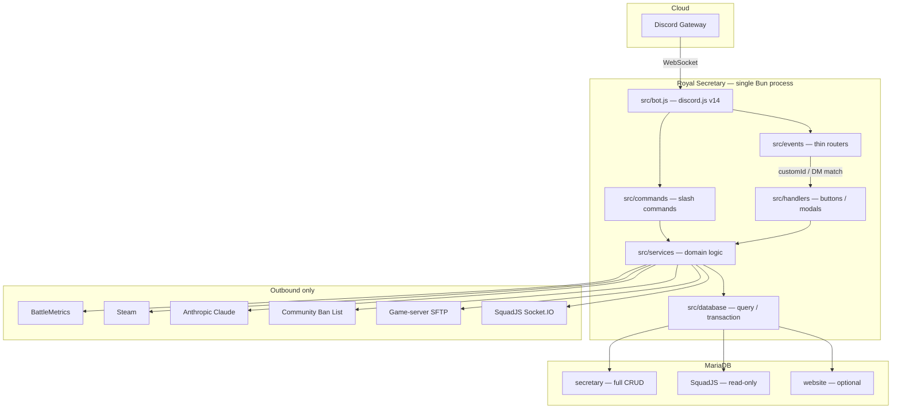
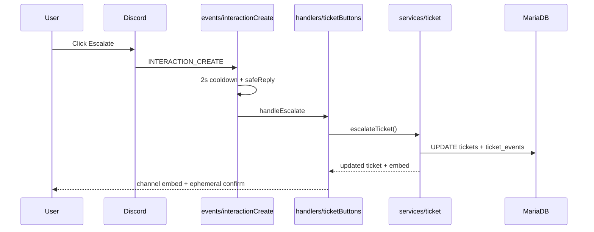
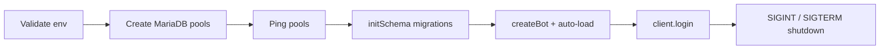

# Royal Secretary

**The operations backbone of Royal Battalion — tickets, recruitment, seeding, and live Squad ops in one Discord process.**

[](https://github.com/oleedv/RoyalSecretaryDiscordBot)
[](https://bun.sh)
[](https://discord.js.org)
[](https://mariadb.org)
[](https://getpino.io)
[](https://www.anthropic.com)
[](https://socket.io)
[](LICENSE)

---

## Overview

Royal Secretary is the Discord back-office for the **Royal Battalion** Squad community. One long-running [Bun](https://bun.sh) process connects to the Discord gateway, holds MariaDB pools for bot data and a read-only SquadJS mirror, and talks outbound to BattleMetrics, Steam, Claude, SFTP, and live game-server sockets.

It exposes **no inbound HTTP surface**. Slash commands, buttons, DMs, reactions, and voice joins all arrive through the Discord gateway and are dispatched through a thin event router into feature handlers and services.

Operational state lives in MariaDB. Transient data (voice sessions, cooldowns, socket connections) stays in memory and is rebuilt from the database on startup.

---

## Architecture



Every user interaction follows the same shape: **event → router → handler → service → database**, then an embed back to the channel.



Boot is fail-fast. Missing secrets or a down secretary database abort the process before login.



---

## Features

| Area | What it does |
|------|----------------|
| **Support tickets** | Five tiers (Normal, Community Officer, Admin Officer, Comp Team, Whitelist). Open via DM or panel. `!r`, `!close`, `!logs` in-channel. Two-hour grace reopen, escalation, anonymous replies, transcripts. |
| **Prospect recruitment** | Two-part application modal, Steam / DOB / playtime validation, mentor claim, community vote, Claude evaluation, automatic team-role assignment. |
| **Seeding** | Live player counts from SquadJS over Socket.IO. Scheduled daily call, opt-in buttons, threshold sessions (default 40 / reset below 20). |
| **Seed tracker** | Monthly leaderboard, progression milestones, whitelist-role rewards, auto-renew at month rollover. |
| **Activity** | Voice sessions (duration, mute, deaf, stream, video) and message counts, rolled into 30/60/90/365-day windows. |
| **Temporary voice** | Join a trigger channel, get a private room plus owner controls (rename, limit, lock, transfer). |
| **Verification** | Challenge-response on the entry panel; correct answer grants the verified role. |
| **Server status** | Live BattleMetrics player counts, layer, and server info — plus a compact quick-status embed. |
| **Config Guardian** | Hourly SFTP poll of game-server configs. Line-by-line diff with secret masking, Discord alert, local backup. |
| **Giveaways** | Monthly weighted game giveaway: start, manual entries, community vote, draw, cancel. |
| **Clan reports** | Staff-only interactive dashboard over SquadJS combat stats. |
| **Comms board** | Live comms-watch board posted to a channel. |
| **Layer rotation** | Validates and highlights the current layer rotation embed. |
| **Timestamps** | `/timestamp` builds a Discord timestamp in everyone's local time; `/timezone` remembers the user's zone. |
| **AI assists** | Ticket suggestions, prospect resume evaluation, daily chat-moderation report. |
| **Admin plumbing** | 30s heartbeat to `bot_status`, message history logger, Pino → `bot_logs`, web-dashboard action queue. |

---

## Prerequisites

- [Bun](https://bun.sh) (runtime and package manager)
- MariaDB 10.11+ reachable from the bot host
- A Discord application with a bot user, a test guild, and these privileged intents enabled:
  - Server Members Intent
  - Message Content Intent
- Optional: Anthropic, Steam, BattleMetrics, and SquadJS credentials for the features that use them

---

## Installation

```bash
git clone https://github.com/oleedv/RoyalSecretaryDiscordBot.git
cd RoyalSecretaryDiscordBot
bun install
cp .env.example .env
```

Fill in the required secrets in `.env`:

```env
DISCORD_TOKEN=your-bot-token
DISCORD_CLIENT_ID=your-application-id
DB_HOST=127.0.0.1
DB_PORT=3306
DB_USER=royal
DB_PASSWORD=secret
DB_NAME=Royal_secretary_staging
NODE_ENV=development
LOG_FORMAT=pretty
```

Edit `settings.development.js` with the guild, channel, and role IDs for your test server. `settings.js` is a loader — it picks `settings.${NODE_ENV}.js`. Do not put secrets in the settings files.

Register slash commands, then start the bot:

```bash
bun run deploy-commands
bun run dev
```

`bun run dev` watches source files and restarts on change. Production:

```bash
bun run start
```

### Docker

```bash
docker compose up --build
```

The image is `oven/bun:latest`, runs as a non-root `botuser`, and copies only `settings.staging.js` / `settings.production.js` (development settings stay off the image). The compose file loads `.env` and maps `host.docker.internal` so the container can reach MariaDB on the host.

CI builds the image, pushes it to GHCR, and restarts the target VPS:

| Branch | Workflow | Target |
|--------|----------|--------|
| `main` | `.github/workflows/deploy-staging.yml` | Staging |
| `production` | `.github/workflows/deploy-production.yml` | Production |

---

## Usage

### Slash commands

| Command | Who | Purpose |
|---------|-----|---------|
| `/ping` | Anyone | Round-trip and WebSocket latency |
| `/activity [user] [days]` | Members (self) / staff (anyone) | Discord activity over a rolling window |
| `/timestamp date time [timezone]` | Anyone | Discord timestamp in every viewer's local time |
| `/timezone` | Anyone | View or clear the saved timezone |
| `/ticket-setup` | Admin | Post the ticket panel |
| `/prospect-setup` | Admin | Post the prospect application panel |
| `/tempvoice-setup` | Admin | Configure the temp-voice trigger channel |
| `/refresh-panels` | Admin | Re-post configured panels |
| `/giveaway start\|add-entry\|leaderboard\|open-vote\|draw\|cancel` | Staff | Monthly game giveaway |
| `/clanreport` | Staff | Interactive clan-report dashboard |
| `/comms-board show\|stop` | Staff | Live comms board |
| `/layer-rotation` | Admin | Re-post the layer rotation embed |
| `/suggest` | Restricted | AI suggestion for the current ticket |
| `/modreport` | Owner | Trigger the daily AI moderation report now |

Ticket channels also accept text commands: `!r` (reply), `!close`, `!logs`.

### Example: `/ping`

```
/ping
→ Pong! Roundtrip: 47ms | WebSocket: 12ms
```

### Example: `/timestamp`

```
/timestamp date:2026-09-06 time:18:00 timezone:Europe/Oslo
→ <t:1757178000:F>  —  Saturday, 6 September 2026 18:00
```

### Example: `/giveaway start`

```
/giveaway start prize:Helldivers 2 channel:#giveaways
```

### Add a slash command

Drop a file in `src/commands/` — it is auto-loaded. No manual registry.

```js
import { SlashCommandBuilder } from 'discord.js';

export default {
  data: new SlashCommandBuilder()
    .setName('example')
    .setDescription('Does a thing'),

  async execute(interaction) {
    await interaction.reply({ content: 'Done.', flags: ['Ephemeral'] });
  },
};
```

Then register it with Discord:

```bash
bun run deploy-commands
```

Commands deploy guild-scoped when `config.guild.id` is set, otherwise globally.

### Add an event listener

```js
import { Events } from 'discord.js';

export default {
  name: Events.GuildMemberAdd,
  async execute(member) {
    // ...
  },
};
```

Save it as `src/events/guildMemberAdd.js`. Set `once: true` for one-shot listeners.

### Add a button handler

1. Export a function from `src/handlers/<feature>Buttons.js`.
2. Register the `customId` in the map in `src/events/interactionCreate.js`.

```js
const buttonHandlers = {
  ticket_escalate_admin: ticketButtons.handleEscalate,
  // ...
};
```

Dynamic ids (`logs_prev:<ticketId>`, `verify_answer_<questionId>`) use pattern matching after the static map misses.

### Query the database

All queries are parameterised. There is no ORM.

```js
import { query, transaction } from './database/connection.js';

await query('SELECT * FROM tickets WHERE id = ?', [id]);

await query(
  'SELECT * FROM players WHERE steam_id = ?',
  [steamId],
  'squadjs',
);

await transaction(async (conn) => {
  await conn.query('INSERT INTO prospects (...) VALUES (?, ?)', [a, b]);
  await conn.query('INSERT INTO prospect_events (...) VALUES (?, ?)', [c, d]);
}, 'secretary');
```

| Pool | Database | Access | Purpose |
|------|----------|--------|---------|
| `secretary` | `Royal_secretary*` | Full CRUD | Bot tables |
| `squadjs` | `SquadJS` | Read-only | Shared game-server data |
| `website` | `royal_battalion*` | Read-only | Optional; disabled on fail |

### Logging

```js
import logger from './logger.js';

const log = logger.child({ module: 'tickets' });
log.info({ ticketId }, 'escalated');
```

Pretty-print when `LOG_FORMAT=pretty`, JSON otherwise. `info`+ records also stream into `bot_logs`.

---

## Tech stack

| Layer | Choice | Notes |
|-------|--------|--------|
| Runtime | [Bun](https://bun.sh) | ESM (`"type": "module"`), `bun test` |
| Discord | [discord.js](https://discord.js.org) `^14.26` | Gateway client, slash commands, buttons, voice |
| Database | [mariadb](https://github.com/mariadb-corporation/mariadb-connector-nodejs) `^3.5` | Three pools, parameterised SQL, schema on boot |
| Logging | [pino](https://getpino.io) `^9` + [pino-pretty](https://github.com/pinojs/pino-pretty) | Console + `bot_logs` transport |
| AI | [@anthropic-ai/sdk](https://github.com/anthropics/anthropic-sdk-typescript) `^0.39` | Prospect eval, ticket hints, mod reports |
| Real-time | [socket.io-client](https://socket.io) `^4.8` | Live SquadJS player / layer updates |
| Time | [luxon](https://moment.github.io/luxon/) `^3.7` | Timezones and `/timestamp` |
| SFTP | [ssh2-sftp-client](https://github.com/theophilusx/ssh2-sftp-client) `^12.1` | Config Guardian |
| Diffing | [diff](https://github.com/kpdecker/jsdiff) `^8` | Config file diffs |
| Images | [sharp](https://sharp.pixelplumbing.com) `^0.34` | Embed image processing |
| Git | [simple-git](https://github.com/steveukx/git-js) `^3.36` | Repo-side git operations |
| Deploy | Docker + GitHub Actions + GHCR | `main` → staging, `production` → prod |

Configuration is two-layer:

- **Secrets** — `.env` (`DISCORD_TOKEN`, `DB_*`, `ANTHROPIC_API_KEY`, `SQUADJS_SERVERS`, …)
- **IDs and toggles** — `settings.development.js` / `settings.staging.js` / `settings.production.js`

`SQUADJS_SERVERS` is pipe-delimited and comma-separated:

```text
production|ws://host:4000|token|1,battle|ws://host:4001|token|2
```

The fourth field is `squadjs_servers.id` and is required for multi-server status.

---

## How to contribute

This bot runs a live community. Keep changes small, tested, and easy to review.

1. Fork the repo (or branch from `main` if you have write access).
2. Create a focused branch: `feat/ticket-timeout`, `fix/seed-tracker-renewal`.
3. Match the existing style:
   - ESM only — `import` / `export`, never `require`
   - Parameterised SQL (`?` placeholders) for every query
   - kebab-case files, camelCase identifiers, `UPPER_SNAKE` constants
   - JSDoc where typing is load-bearing (no TypeScript)
   - No emojis in code, commits, or generated content
4. Put domain logic in `src/services/{feature}/`, interaction wiring in `src/handlers/`, and keep `src/events/` thin.
5. Add or extend tests next to the code (`*.test.js`) and run:

   ```bash
   bun test
   ```

6. Commit with [Conventional Commits](https://www.conventionalcommits.org), one line:

   ```text
   feat(tickets): add force-close confirmation
   fix(seed-tracker): skip same-day renewals
   ```

7. Open a pull request against `main`. Staging deploys from `main`; production deploys from the `production` branch.

### Database changes

Edit `src/database/schema.js`. Add the `CREATE TABLE IF NOT EXISTS` statement and any guarded `ALTER` for forward migrations. Schema runs on the next boot — there is no separate migrate command.

### Things not to break

- **Uncached DM fallback** in `src/bot.js` — ticket and prospect DM relay depend on it.
- **Ticket close is not final** — a user reply within two hours reopens the ticket. Use force-close to end it immediately.
- **`settings.js` is a loader** — edit the file that matches `NODE_ENV`.
- **No inbound HTTP** — health is the heartbeat row in `bot_status`, not a webhook.

---

## License

Released under the [MIT License](LICENSE).

```
Copyright (c) 2026 Ole Nørholm
```

You may use, copy, modify, merge, publish, distribute, sublicense, and/or sell
copies of this software, provided the copyright notice and permission notice
are included in all copies. The software is provided "as is", without warranty.

---

Royal Battalion · Squad · [GitHub](https://github.com/oleedv/RoyalSecretaryDiscordBot)
